## Resturant Application

---

## Description

This program provides a service for managing restaurants, including foods catigories, foods item, employees, and invoices. It also includes all the necessary reports, a point of sale, and enables direct sales or delivery services.

---

## Used Technologies
Project is created with:
- C#
- .Net framework 4.8 or later
- ADO.Net to handle database and queries
- SQL Server Management Studio (SSMS) 

---

## Prerequisites
- .Net framework 4.8 or later
- SQL Server Management Studio (SSMS)

----

## How-To run
- Install SQL Server Management Studio (SSMS) and create Database
- Run "KagattiRestaurant" Application in "Debug" folder

- Click "New" to connect to your database 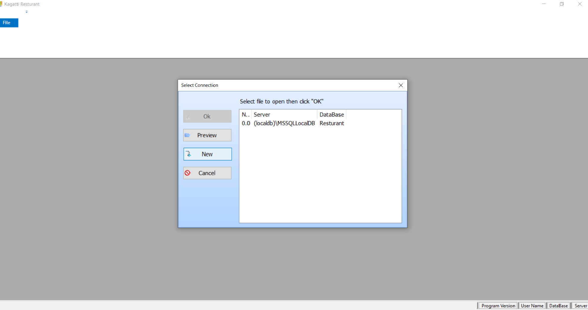

- You have to enter "server name" and select "authentication" after that click "test" then you can select your database you want to use 

- Here you have to select the correct database and click OK to create all tables in the selected database 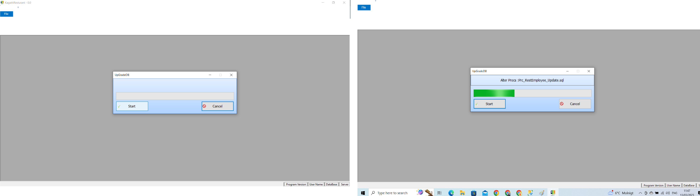

- For first time you will create User Admin to mange the application 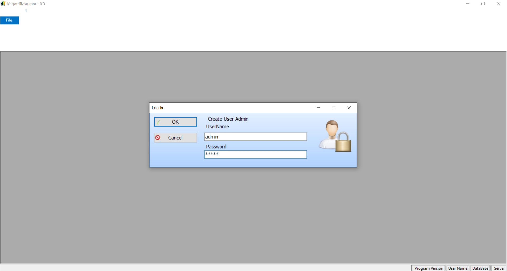
 
 ## Card
 - The main interface of the application includes Cards, Reports, and Tools. At the bottom information about the database and the current user 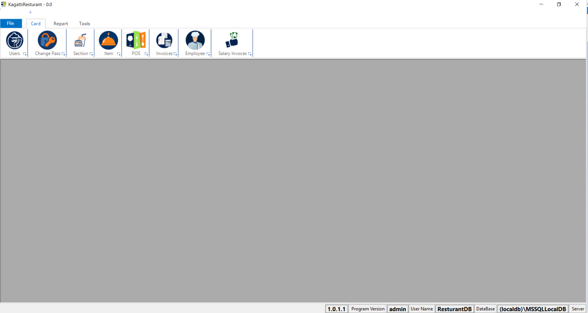

- For every card ther are CRUD operations "create, read, update and delete". 
### Users
To manage all application users and their permissions

----

### Change Password
To Change the current user's password

 ----
### Section
To manage all food categories in the restaurant and choose the kitchen printer, "Is Product" means whether this category have quantity and you must manage

----
### Item
Managing the food item and determining the category to which it belongs, the price and the quantity, if any

----
### Invoices
To manage all purchase invoices to include in the reports

----
### Employee
To manage all employees working in the restaurant

----
### Salary Invoices
Managing the employees' salaries process, where the employee can receive his salary in installments and can be given salary increases or deductions

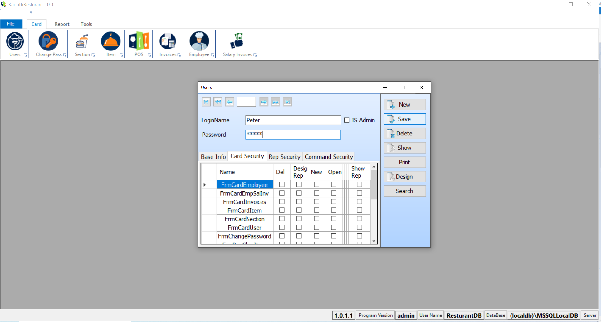
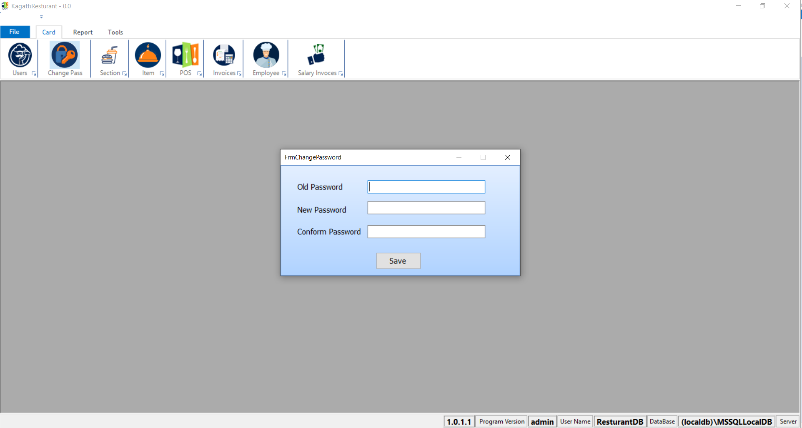
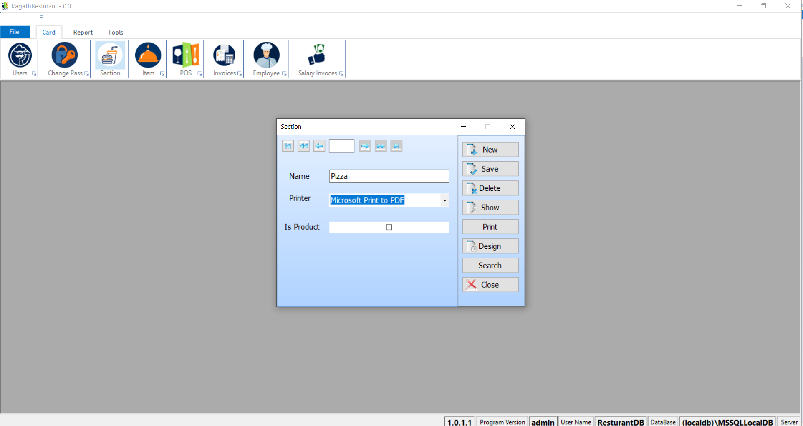
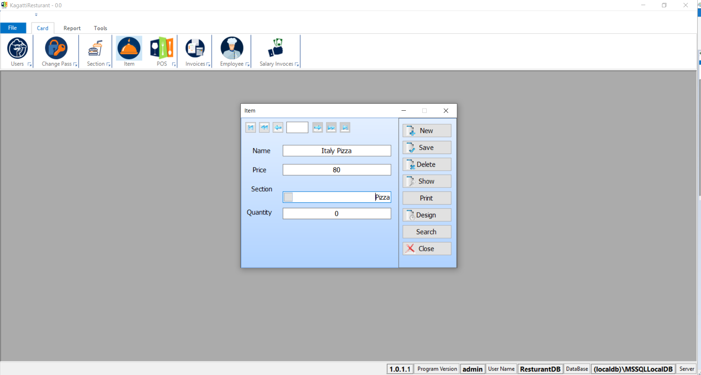
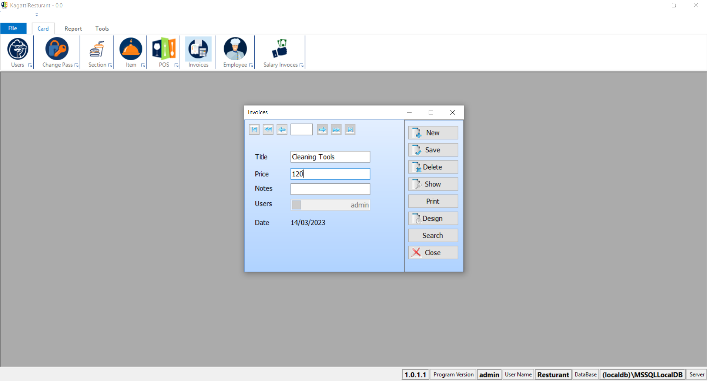
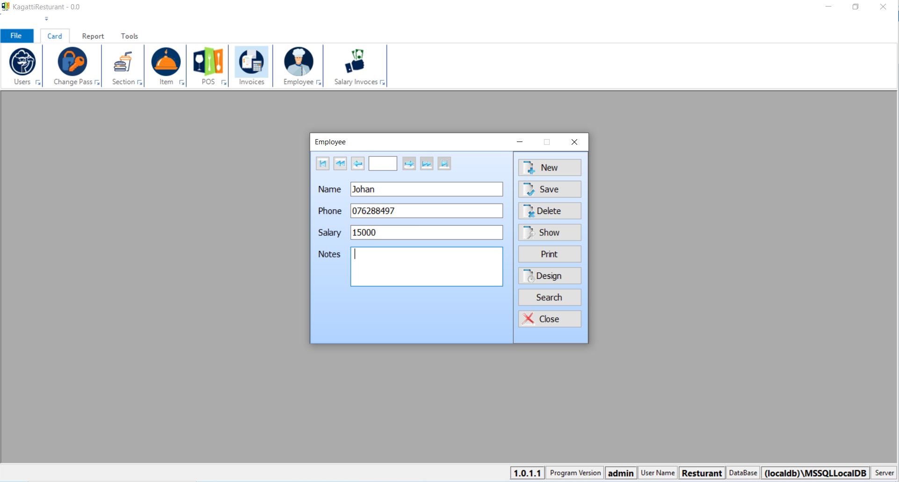
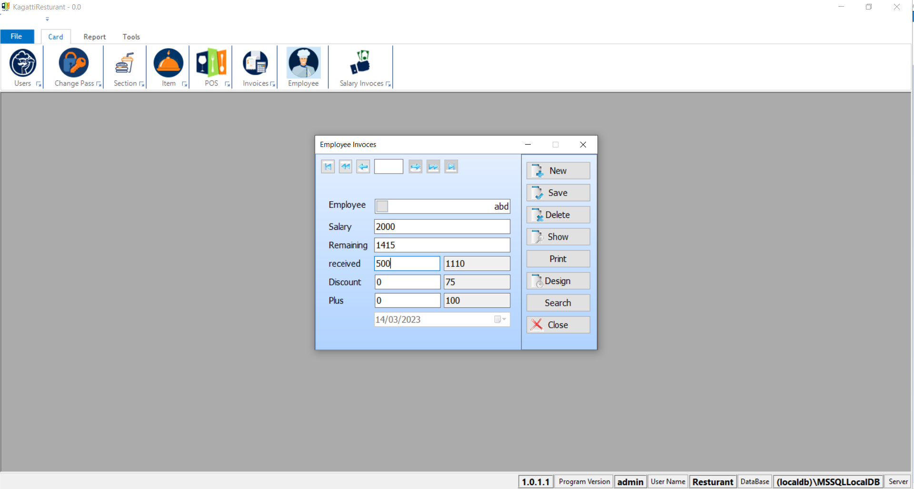

----

## Tools
Here you can translate your application to another language, and adjust the setting such as tax and get database Backup

----
## Report
All reports enable you to specify the date period that you want to know the results of, and you can select a specific user, if you do not specify a specific user, the report will be for all users

### Receipts:
To get sales of meals at the point of sale

-----

### Item
To get sales of special item at the point of sale

----

### Total Section
To get a graph containing sales statistics between all sections

----

### Total Item
To get a graph containing sales statistics between all item for specific section

----

### Total Top
To get a graph containing sales statistics between all items in the restaurant

-----

### Invoices
to get all the Invoices that done between two specific date

----
### Final
For the final result of the restaurant, profit or loss , with the current balance

----
### Employees
To obtain all information about the employee's salary, and to review all financial operations performed

----
### Delivery
To get all sales sold at the point of sale via the delivery service

----
### Delivery Non
To get all sales that were sold at the point of sale via the delivery service but were not completed for some reason

----
 ## Point Of Sale
 This window provides a sale service for the restaurant’s customers. The employee who logged in can view all the departments in the restaurant, and by clicking on the name of the department, all the items of this department it are displayed, and by clicking on it, it is added to the invoice list with the feature of adding or decreasing the quantity or delete it with a review of the single price, the total price, and the amount of tax. When you finish adding the items that the customer wants, you must click on the Pay button. Two options will be displayed for the type of order, either delivery or direct. By choosing direct, the invoice will be printed and money will be received. Either delivery means no Receiving the money, and the order will be added to the delivery role. When the order is delivered, the employee will have to click on the order button and press the receive button, or he can delete it.
If the employee's authority is a manager, he can also delete an old order for a reason, with notes added about the reason.

